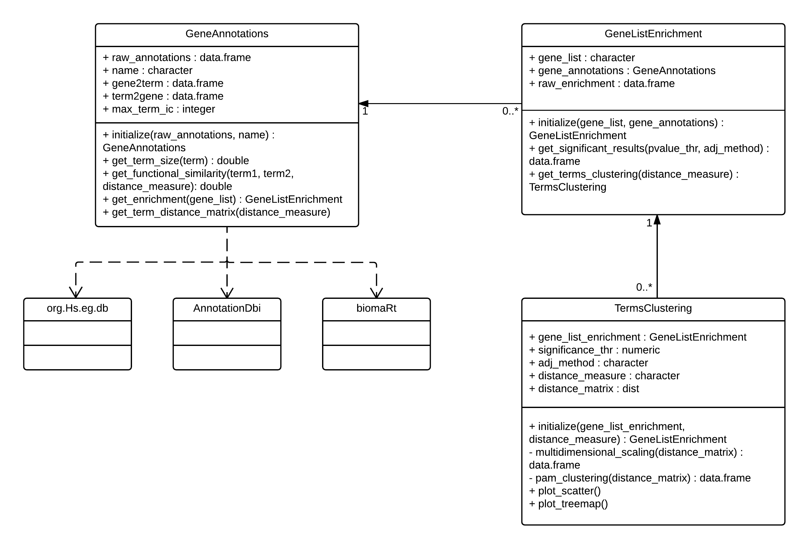

```{r setup, include=FALSE, warning=FALSE}
knitr::opts_chunk$set(echo = TRUE, collapse = TRUE, comment = "#>")
devtools::load_all()
```

## Using Object Oriented (OO) programming

Using OO allows achieving **high cohesion** and **low coupling**, which facilitates all the software development cycle from development to maintenance, including testing. Following the principle **"Don't repeat yourself"** (https://en.wikipedia.org/wiki/Don't_repeat_yourself) is also enhanced with a good OO design. There are 3 OO models in R, we will be using S4 as it is the model most used in Bioconductor. Furthermore, we want to foster **code reuse** from existing Bioconductor S4 classes.



## Annotations

This model allows us to support multiple annotations for enrichment. So far the supported annotations based on AnnotationDbi data source and some custom resources are:

* Gene Ontology (from org.Hs.eg.db)
* KEGG pathways (from org.Hs.eg.db)
* OMIM diseases (from org.Hs.eg.db)
* HPO phenotypes (from http://compbio.charite.de/jenkins/job/hpo.annotations.monthly/lastStableBuild/artifact/annotation/ALL_SOURCES_TYPICAL_FEATURES_phenotype_to_genes.txt)

These annotations can be loaded as follows:
```{r, eval=FALSE}
goa <- TCGAome::load_goa()
kegg <- TCGAome::load_kegg()
omim <- TCGAome::load_omim()
hpo <- TCGAome::load_hpo()
```

The object created contains the following information:
```{r, warning=FALSE, message=FALSE}
kegg <- TCGAome::load_kegg()
str(kegg, list.len = 5, vec.len = 5)
```

### Metrics

For any term within the **TCGAome::GeneAnnotations** object we can obtain its **relative frequency** of annotation, which might be useful to compute the **Information Content** within a term.

```{r, warning=FALSE, message=FALSE}
random_kegg_term = kegg@term2gene$Term[runif(1, max = length(kegg@term2gene$Term))]
random_kegg_term
TCGAome::get_term_freq(kegg, random_kegg_term) 
```

For any two terms within the GeneAnnotations object we can obtain its **functional similarity** based on the binary distances implemented in TCGAome.

```{r, warning=FALSE, message=FALSE}
random_kegg_term1 = kegg@term2gene$Term[runif(1, max = length(kegg@term2gene$Term))]
random_kegg_term2 = kegg@term2gene$Term[runif(1, max = length(kegg@term2gene$Term))]
random_kegg_term1
random_kegg_term2
TCGAome::get_functional_similarity(kegg, random_kegg_term1, random_kegg_term2, distance_measure = "UI")
```

The supported binary distances are: UI, cosine, Bray-Curtis and binary.

This model should be extended to support **semantic similarity** measures based on the ontology structure. This is a special case for some of these annotation resources which are also backed by an ontology, like GO and HPO. On the previous implementation of TCGAome we used **GoSemSim** for the semantic similarity within GO terms. We need to study if this can be easily extended to other ontologies.

### Extend annotation support

It is relatively simple to extend the support to additional annotations, we just need to provide the association between genes and terms in a tall-skinny data frame with columns "Gene" and "Term".
```{r, eval=FALSE}
uniKeys <- AnnotationDbi::keys(org.Hs.eg.db::org.Hs.eg.db, keytype="SYMBOL")
cols <- c("PATH")
kegg_raw <- AnnotationDbi::select(org.Hs.eg.db::org.Hs.eg.db, keys=uniKeys, columns=cols, keytype="SYMBOL")
kegg_raw <- kegg_raw[, c(1, 2)]
colnames(kegg_raw) <- c("Gene", "Term")
kegg <- TCGAome::GeneAnnotations(raw_annotations = kegg_raw, name="KEGG-Human")
```


## Enrichment

The previous TCGAome version used the package **topGO** for computing the enrichment of GO terms. This package is limited to GO. The computation employed was a Fisher's test, we were not making use of the advanced functionality in topGO. Thus, in order to gain flexibility the enrichment computation was reimplemented inside the class **TCGAome::GeneListEnrichment**.

We can compute enrichment for a given list of genes based on a preloaded annotation:

```{r, warning=FALSE, message=FALSE}
gene_list <- c("ZNF638", "HNRNPU", "PPIAL4G", "RAPH1", "USP7", "SUMO1P3",
          "TMEM189.UBE2V1", "ZNF837", "LPCAT4", "ZFPL1", "STAT3", "XRCC1",
          "STMN1", "PGR", "RB1", "KDR", "YBX1", "YAP1", "FOXO3", "SYK", "RAB17",
          "TTC8", "SLC22A5", "C3orf18", "ANKRA2", "LBR", "B3GNT5", "ANP32E",
          "JOSD1", "ZNF695", "ESR1", "INPP4B", "PDK1", "TSC2", "AR", "HSPA1A",
          "CDH3", "SMAD4", "CASP7", "GMPS", "NDC80", "EZH2", "MELK", "CDC45",
          "CRY2", "KLHDC1", "MEIS3P1", "FBXL5", "EHD2", "CCNB1", "GSK3A",
          "DVL3", "NFKB1", "COL6A1", "CCND1", "BAK1")
kegg_enrichment <- TCGAome::get_enrichment(kegg, gene_list = gene_list)
str(kegg_enrichment, list.len = 5, vec.len = 5)
```

Or alternatively:
```{r, eval=FALSE}
kegg_enrichment <- TCGAome::GeneListEnrichment(gene_annotations = kegg, gene_list = gene_list)
```

And extract significant results:

```{r, warning=FALSE, message=FALSE}
TCGAome::get_significant_results(kegg_enrichment, significance_thr = 0.05, adj_method = "none")
```


## Visualizing enrichment results (clustering + MDS)

To visualize enriched terms we use a dimensionality reduction approach based on clustering our results, select then a representative member of each cluster and plot them into 2D by using multidimensional scaling.

Tu run this pipeline we need to create an object of type "TermsClustering" as follows:

```{r, warning=FALSE, message=FALSE}
kegg_term_clustering <- TCGAome::TermsClustering(kegg, kegg_enrichment, "cosine", significance_thr = 0.05, adj_method = "none", max_clusters = 10)
str(kegg_term_clustering@distance_matrix, vec.len = 5)
str(kegg_term_clustering@significant_results, vec.len = 5)
```

Or alternatively:
```{r, warning=FALSE, message=FALSE, eval=FALSE}
kegg_term_clustering <- TCGAome::get_terms_clustering(kegg_enrichment, kegg, "cosine", significance_thr = 0.05, adj_method = "none", max_clusters = 10)
```

The clustering is performed based on a similarity metric between terms. The supported similarity metrics are based on the genes annotated to each term. As genes are functional elements we called it functional similarity. We support so far several metrics based on binary vector distances, every term is associated to a binary vector with the length of the total number of genes that our term annotations contain. Each position in the vector contains 1 or 0 if the given term is annotated with that gene or not. So far, we support a number of binary distances: Union-Intersection (UI), cosine, Bray-Curtis and binary.

To decide the optimal number of clusters we perform a silhouette analysis. We use by default a maximum of clusters of 10 as otherwise results become quickly complex, this can be changed using parameter _max_clusters_.

Evaluate the optimal number of clusters with silhouette analysis:

```{r, warning=FALSE, message=FALSE}
TCGAome::plot_silhouette_analysis(kegg_term_clustering)
```

We perform a PAM clustering with the obtained optimal number of clusters and select a term representative for each of the clusters. The criteria to select the term representative is as follows: for each cluster if there is any term with a frequency of annotation below a given threshold select the term with the lowest enrichment p-value; otherwise select the term with the lowest p-value across all terms independently of their frequency of annotation.

Also based on the similarity metrics between terms we can perform a Multidimensional Scaling to plot our clusters in a reduced number of dimensions. To evaluate how well the first components in our MDS explains the observed variance:

```{r, warning=FALSE, message=FALSE}
TCGAome::plot_explained_variance(kegg_term_clustering)
```

Finally plot the results of the clustering and MDS.

```{r, warning=FALSE, message=FALSE, fig.width=7, fig.height=6}
TCGAome::plot_mds(kegg_term_clustering, all = TRUE)
```

As this scatter plot might quickly get very noisy you may plot only the representative terms for each cluster.

```{r, warning=FALSE, message=FALSE, fig.width=7, fig.height=6}
TCGAome::plot_mds(kegg_term_clustering, all = FALSE)
```

And do the same for other annotation resources.
```{r, warning=FALSE, message=FALSE, fig.width=7, fig.height=6}
goa <- TCGAome::load_goa()
goa_enrichment <- TCGAome::get_enrichment(goa, gene_list = gene_list)
goa_term_clustering <- TCGAome::TermsClustering(goa, goa_enrichment, distance_measure = "cosine", significance_thr = 0.05, adj_method = "none", max_clusters = 10)
TCGAome::plot_mds(goa_term_clustering, all = TRUE)
```

```{r, warning=FALSE, message=FALSE, fig.width=7, fig.height=6}
hpo <- TCGAome::load_hpo()
hpo_enrichment <- TCGAome::get_enrichment(hpo, gene_list = gene_list)
hpo_term_clustering <- TCGAome::TermsClustering(hpo, hpo_enrichment, distance_measure = "cosine", significance_thr = 0.05, adj_method = "none", max_clusters = 10)
TCGAome::plot_mds(hpo_term_clustering, all = TRUE)
```

```{r, warning=FALSE, message=FALSE, fig.width=7, fig.height=6}
omim <- TCGAome::load_omim()
omim_enrichment <- TCGAome::get_enrichment(omim, gene_list = gene_list)
omim_term_clustering <- TCGAome::TermsClustering(omim, omim_enrichment, distance_measure = "cosine", significance_thr = 0.05, adj_method = "none", max_clusters = 10)
TCGAome::plot_mds(omim_term_clustering, all = TRUE)
```


### Evaluating the different similarity metrics

The similarity metric employed affects how terms are distributed and separated between them. It is important to assess how well a given similarity metric explains the variance in our annotation terms in the first components of the MDS that will be used to plot our results.

```{r, warning=FALSE, message=FALSE, fig.width=7, fig.height=6}
goa_term_clustering_ui <- TCGAome::TermsClustering(goa, goa_enrichment, distance_measure = "UI", significance_thr = 0.05, adj_method = "none", max_clusters = 10)
goa_term_clustering_bray <- TCGAome::TermsClustering(goa, goa_enrichment, distance_measure = "bray-curtis", significance_thr = 0.05, adj_method = "none", max_clusters = 10)
goa_term_clustering_binary <- TCGAome::TermsClustering(goa, goa_enrichment, distance_measure = "binary", significance_thr = 0.05, adj_method = "none", max_clusters = 10)
plot_explained_variance_cosine <- TCGAome::plot_explained_variance(goa_term_clustering)
plot_explained_variance_ui <- TCGAome::plot_explained_variance(goa_term_clustering_ui)
plot_explained_variance_bray <- TCGAome::plot_explained_variance(goa_term_clustering_bray)
plot_explained_variance_binary <- TCGAome::plot_explained_variance(goa_term_clustering_binary)
cowplot::plot_grid(
    plot_explained_variance_cosine, 
    plot_explained_variance_ui,
    plot_explained_variance_bray,
    plot_explained_variance_binary,
    labels = c('cosine', 'UI', 'Bray-Curtis', 'binary'))
```

It is also important to assess how the similarity metric affects the optimal number of clusters.

```{r, warning=FALSE, message=FALSE, fig.width=7, fig.height=6}
plot_silhouette_analysis_cosine <- TCGAome::plot_silhouette_analysis(goa_term_clustering)
plot_silhouette_analysis_ui <- TCGAome::plot_silhouette_analysis(goa_term_clustering_ui)
plot_silhouette_analysis_bray <- TCGAome::plot_silhouette_analysis(goa_term_clustering_bray)
plot_silhouette_analysis_binary <- TCGAome::plot_silhouette_analysis(goa_term_clustering_binary)
cowplot::plot_grid(
    plot_silhouette_analysis_cosine, 
    plot_silhouette_analysis_ui,
    plot_silhouette_analysis_bray,
    plot_silhouette_analysis_binary,
    labels = c('cosine', 'UI', 'Bray-Curtis', 'binary'))
```
